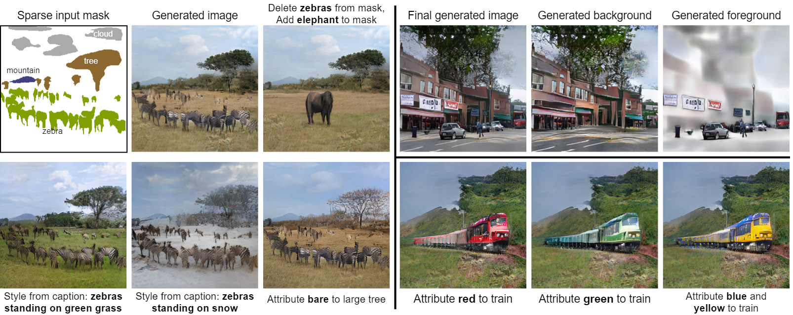

# Controlling Style and Semantics in Weakly-Supervised Image Generation

This is the project repository for the paper "Controlling Style and Semantics in Weakly-Supervised Image Generation", published at ECCV 2020 as a spotlight paper.

> Dario Pavllo, Aurelien Lucchi, and Thomas Hofmann. [Controlling Style and Semantics in Weakly-Supervised Image Generation](https://arxiv.org/abs/1912.03161). In European Conference on Computer Vision (ECCV), 2020.




### Setup
See [SETUP.md](SETUP.md) for the instructions on how to set up the datasets, detections, and the required libraries.

### Pretrained models and FID evaluation
We provide some pretrained models in the [Releases](https://github.com/dariopavllo/style-semantics/releases) section of this repository. 

- `pretrained_vg_attributes_onestep`: One-step model trained on VG, with style control using attributes
- `pretrained_vg_attributes_twostep`: Two-step model trained on VG, with style control using attributes
- `pretrained_coco_text_onestep`: One-step model trained on COCO, with style control using captions

You should download and extract these archives inside the `checkpoints` directory (create it if it does not exist),
You can then evaluate the FID scores on COCO-val by running:
```
python fid.py --name pretrained_vg_attributes_onestep --dataset_mode coco_sparse --gpu_ids 0,1,2,3 --batchSize 40 --nThreads 8 --embed_attributes
python fid.py --name pretrained_vg_attributes_twostep --dataset_mode coco_sparse --gpu_ids 0,1,2,3 --batchSize 40 --nThreads 8 --embed_attributes --two_step_model
python fid.py --name pretrained_coco_text_onestep --dataset_mode coco_sparse --gpu_ids 0,1,2,3 --batchSize 40 --nThreads 8 --embed_captions
```
You can of course tune `--gpu_ids`, `--batchSize`, and `--nThreads` to maximize performance on your machine. Our recommendation is to use all GPUs and a total batch size of 10*n_gpus. Since data loading represents a significant bottleneck, you should set `--nThreads` to the number of cores of your machine minus one.

If you want to evaluate FID scores on your own trained models, make sure to specify the same arguments that you used for the training script. Set `--dataset_mode` to `coco_sparse` to evaluate the scores on COCO-val, even if you trained the model on Visual Genome.

### Generation from sketches and manipulation
To generate images from hand-drawn sketches like the ones above, check out the notebook [SketchingDemo.ipynb](SketchingDemo.ipynb). The interface is very simple but provides a good starting point. For this demo, you only need to set up the pretrained model `pretrained_vg_attributes_onestep`, and a GPU is not required.

We also provide the notebook [ManipulationDemo.ipynb](ManipulationDemo.ipynb) for manipulating existing images using the two-step model. This demo requires the pretrained model `pretrained_vg_attributes_twostep` and the Visual Genome dataset.

### Generating images
Images can be generated by running the script `test.py` with the same syntax as the FID evaluation script above, e.g.
```
python test.py --name pretrained_vg_attributes_onestep --dataset_mode coco_sparse --gpu_ids 0,1,2,3 --batchSize 40 --nThreads 8 --embed_attributes
```
This will generate images using input masks from the COCO validation set. Set `--dataset_mode vg_sparse` to use masks from the Visual Genome validation set.
Generated images will be saved to the `results/` directory.

### Training from scratch
Ideally, training a new model requires a machine with 8 GPUs in order to reach a sufficient batch size (32 for the one-step model, 24 for the two-step model). The syntax is the same as the FID evaluation/testing scripts. For instance, to train the one-step VG model with attributes you should run:
```
python train.py --name vg_attributes_onestep --dataset_mode vg_sparse --gpu_ids 0,1,2,3,4,5,6,7 --batchSize 32 --nThreads 16 --embed_attributes
```
Note that we specified `--dataset_mode vg_sparse` to select the Visual Genome training set (testing can then be done on the COCO validation set).

To train a two-step model, it suffices to add the flag `--two_step_model`. For the model with captions (COCO training set only), you have to specify `--embed_captions`, and it is also **highly recommended** to specify `--use_precomputed_captions` to load cached BERT representations. See [SETUP.md](SETUP.md) for instructions on how to build the cache. If you do not use this flag, you might run into out-of-memory errors and training will also become slower.

For the one step-model, training requires 6-7 days on 8 Pascal GPUs, while the two-step model requires about two weeks. You might also want to experiment with the `--benchmark` flag to enable the CuDNN benchmark mode and speed up convolutions.

### Reference
If you use this work in your research, consider citing our paper:
```
@inproceedings{pavllo2020stylesemantics,
  title={Controlling Style and Semantics in Weakly-Supervised Image Generation},
  author={Pavllo, Dario and Lucchi, Aurelien and Hofmann, Thomas},
  booktitle={European Conference on Computer Vision (ECCV)},
  year={2020}
}
```

### License and acknowledgments
This work builds upon the [SPADE codebase](https://github.com/NVlabs/SPADE), and is released under the same license ([CC BY-NC-SA 4.0](https://creativecommons.org/licenses/by-nc-sa/4.0/)). See [LICENSE.md](LICENSE.md) for more details.
We also adopt the third-party library [Synchronized-BatchNorm-PyTorch](https://github.com/vacancy/Synchronized-BatchNorm-PyTorch), which is licensed under the MIT license.
